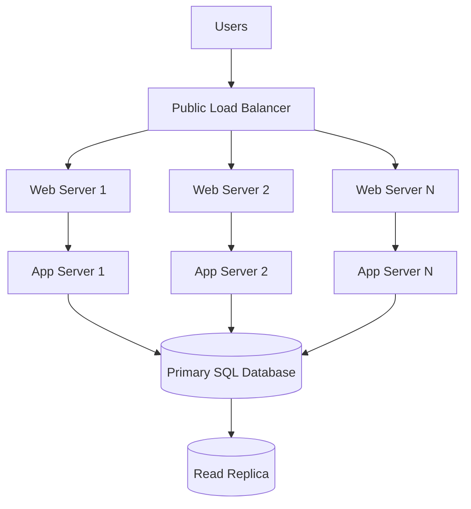
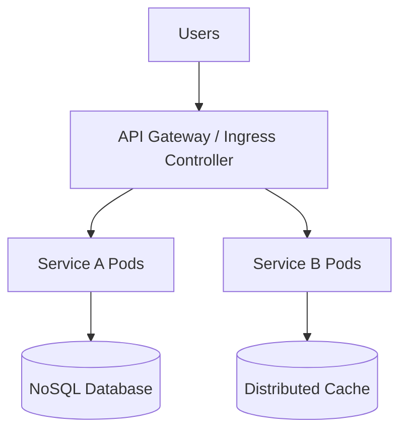
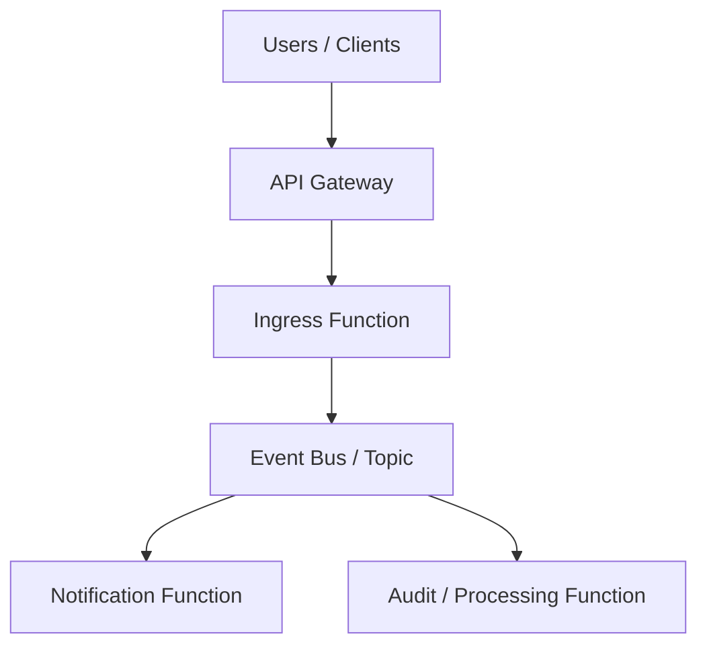
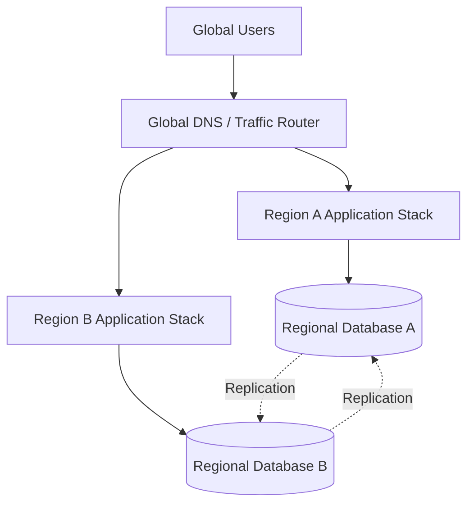
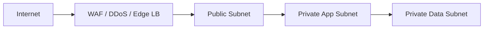

# Multi-Cloud Architecture & Scaling Standards Handbook

Standardized reference guidance for building scalable, secure, production-grade systems across AWS, Azure, and Google Cloud Platform.

## Audience

Mid-level engineers, senior engineers, solution architects, and technical leads who need a common architecture vocabulary and a repeatable set of scaling and security standards.

## Principles

- Design for failure, not steady state.
- Prefer managed services where they reduce operational risk.
- Scale horizontally before vertically when the workload allows it.
- Separate public entry points from private compute and private data planes.
- Use least privilege, short-lived identities, and encryption by default.
- Choose an architecture because of workload characteristics, not because it is fashionable.

---

## Module 1: The Classic 3-Tier Web Architecture

### The Concept

The classic 3-tier architecture separates a system into three concerns:

- Presentation layer: web tier that accepts user traffic and serves frontend content.
- Logic layer: application tier that executes business logic, session workflows, and integrations.
- Data layer: database tier that persists transactional state.

This pattern remains one of the most reliable foundations for enterprise systems because each layer can evolve, scale, and be secured independently.

### Mermaid Diagram

### Detailed Explanation & When to Use It

This architecture is appropriate when teams want strong separation of concerns without introducing the operational overhead of a distributed microservices estate. It is particularly effective for standard monolithic web applications, internal line-of-business portals, enterprise CRUD systems, and lift-and-shift migrations from on-premises environments.

Use it when:

- The application is deployed as one primary codebase.
- OS-level access or custom middleware configuration is required.
- The team prefers virtual machine operations over Kubernetes or serverless abstractions.
- Stateful application behavior or legacy software components are difficult to containerize.

Avoid it when rapid independent deployment of many services is the primary organizational requirement.

### Scaling Strategy

Scaling usually happens horizontally at the web and application tiers.

- Place web and app instances in separate auto-scaling pools.
- Scale based on CPU, memory, request count, queue depth, or response latency.
- Keep instances stateless where possible so they can be replaced automatically.
- Move session state out of local memory into a distributed cache if session affinity becomes a bottleneck.
- Use read replicas to offload read-heavy traffic from the primary database.
- Scale vertically at the database layer only when the transactional engine requires stronger single-node performance.

Operationally, this model scales well until the monolith itself becomes the release bottleneck or the database becomes the primary throughput constraint.

### Cloud-Specific Mappings

| Layer | AWS | Azure | GCP |
|---|---|---|---|
| Public entry | Application Load Balancer | Azure Load Balancer or Application Gateway | Cloud Load Balancing |
| Web tier VMs | EC2 Auto Scaling Group | Virtual Machine Scale Sets | Managed Instance Group |
| App tier VMs | EC2 Auto Scaling Group | Virtual Machine Scale Sets | Managed Instance Group |
| Managed SQL | Amazon RDS / Aurora | Azure SQL Database / SQL Managed Instance | Cloud SQL |
| Read replicas | RDS Read Replica / Aurora Replica | Azure SQL read scale-out / geo-replica | Cloud SQL read replica |
| Secrets / keys | AWS KMS + Secrets Manager | Azure Key Vault | Cloud KMS + Secret Manager |

---

## Module 2: Containerized Microservices (Kubernetes)

### The Concept

Containerized microservices split an application into independently deployable services running in containers, usually orchestrated by Kubernetes. Traffic enters through an ingress or API gateway and is routed to the correct service. Each service owns its runtime, release cadence, and often its own data boundary.

### Mermaid Diagram

### Detailed Explanation & When to Use It

This architecture works best when many teams need to release services independently, when the platform must support multiple languages or frameworks, or when domain boundaries are mature enough to justify service ownership.

Use it when:

- Independent deployment lifecycles matter more than centralized simplicity.
- Teams are comfortable with container operations, observability, and service contracts.
- You need polyglot runtime support.
- The system naturally decomposes into bounded contexts.

It is a poor fit for small teams that do not have the operational maturity to handle service discovery, retries, distributed tracing, ingress security, and failure isolation.

### Scaling Strategy

Kubernetes introduces two core scaling planes.

- Horizontal Pod Autoscaler scales the number of pods for a service based on CPU, memory, or custom metrics such as requests per second, queue lag, or latency.
- Cluster Autoscaler grows or shrinks worker nodes when the scheduler can no longer place pods efficiently.

Additional practices:

- Keep services stateless and externalize state to databases, queues, and caches.
- Use pod disruption budgets and rolling deployments for safer upgrades.
- Apply request and limit policies to avoid noisy-neighbor failures.
- Scale hot services independently instead of scaling the entire system.

### Cloud-Specific Mappings

| Capability | AWS | Azure | GCP |
|---|---|---|---|
| Managed Kubernetes | Amazon EKS | Azure Kubernetes Service (AKS) | Google Kubernetes Engine (GKE) |
| Ingress / API entry | AWS Load Balancer Controller / API Gateway | Application Gateway Ingress Controller / API Management | GKE Ingress / API Gateway |
| Container registry | Amazon ECR | Azure Container Registry | Artifact Registry |
| NoSQL database | DynamoDB | Cosmos DB | Firestore / Bigtable |
| Cache | ElastiCache | Azure Cache for Redis | Memorystore |
| Metrics / autoscale inputs | CloudWatch / Prometheus | Azure Monitor / Managed Prometheus | Cloud Monitoring / Managed Service for Prometheus |

---

## Module 3: Modern Serverless & Event-Driven Architecture

### The Concept

Serverless and event-driven systems decouple producers from consumers. A request enters through an API gateway, a function handles the initial workflow, then emits an event onto a bus or topic. Downstream consumers process that event asynchronously.

This reduces direct service-to-service dependency chains and allows each consumer to scale independently.

### Mermaid Diagram

### Detailed Explanation & When to Use It

This pattern is ideal for bursty, unpredictable workloads where keeping infrastructure warm 24/7 is wasteful. It is also strong for integration glue, asynchronous back-office workflows, fan-out event processing, and rapid prototyping.

Use it when:

- Traffic is uneven or highly spiky.
- Many workflows are naturally asynchronous.
- You want to minimize operational ownership of servers.
- Individual functions are short-lived and event-oriented.

Avoid it when long-running compute, extreme low-latency constraints, or complex transaction coordination dominate the workload.

### Scaling Strategy

Serverless platforms scale elastically by increasing concurrent function executions.

- Scale-to-zero reduces idle cost when no requests exist.
- Concurrency expands quickly under load until platform or account limits are reached.
- Event buses and topics absorb spikes and smooth downstream processing.
- Consumer functions can scale independently according to subscription pressure.

Critical guardrails:

- Define concurrency limits to prevent runaway spend or downstream overload.
- Use dead-letter queues or poison-message handling.
- Make all handlers idempotent because retries are normal.
- Monitor cold starts for latency-sensitive paths.

### Cloud-Specific Mappings

| Capability | AWS | Azure | GCP |
|---|---|---|---|
| API entry | Amazon API Gateway | Azure API Management / Functions HTTP trigger | API Gateway / Cloud Endpoints |
| Serverless compute | AWS Lambda | Azure Functions | Cloud Functions / Cloud Run functions |
| Event router / topic | EventBridge / SNS / SQS | Event Grid / Service Bus | Pub/Sub |
| Workflow orchestration | Step Functions | Durable Functions / Logic Apps | Workflows |
| Observability | CloudWatch / X-Ray | Azure Monitor / Application Insights | Cloud Logging / Cloud Trace |

---

## Module 4: Global High Availability (Multi-Region)

### The Concept

Global high availability designs for regional failure, not just zonal failure. The control plane routes traffic across regions using active-active or active-passive patterns, while data is replicated across regions according to durability, recovery, and consistency requirements.

### Mermaid Diagram

### Detailed Explanation & When to Use It

This architecture exists to survive catastrophic regional disruption and to reduce latency for globally distributed users. It requires strong discipline around failover, data replication, health checks, and operational runbooks.

Use it when:

- The application is Tier 0 or business critical.
- Regional downtime is unacceptable.
- Users are globally distributed and low latency matters.
- Compliance or resilience objectives require demonstrable disaster tolerance.

The biggest tradeoff is complexity. Multi-region systems introduce replication lag, routing policy decisions, failover orchestration, and harder incident analysis.

### Scaling Strategy

Scaling occurs at both regional and global layers.

- Geo-routing sends users to the closest healthy region.
- Active-active designs distribute traffic continuously across multiple regions.
- Active-passive designs keep a warm or hot secondary region ready for failover.
- Global databases replicate state across regions, but the business must account for replication lag and conflict handling.

Key design questions:

- Can the workload tolerate eventual consistency?
- Is write locality region-bound or globally shared?
- What are the RTO and RPO targets?

### Cloud-Specific Mappings

| Capability | AWS | Azure | GCP |
|---|---|---|---|
| Global traffic routing | Route 53 / Global Accelerator | Azure Front Door / Traffic Manager | Global Cloud Load Balancing / Cloud DNS |
| Regional app platform | EC2 / ECS / EKS in multiple regions | VMSS / AKS / App Service in multiple regions | MIG / GKE / Cloud Run in multiple regions |
| Multi-region database | DynamoDB Global Tables / Aurora Global Database | Cosmos DB / Azure SQL geo-replication | Cloud Spanner / AlloyDB cross-region / Cloud SQL replicas |
| Edge security | AWS WAF + Shield | Azure WAF + DDoS Protection | Cloud Armor |

---

## Module 5: Enterprise Network & Security Standards

### Network Isolation

Every production system must run inside a private network boundary.

- AWS uses VPCs.
- Azure uses VNets.
- GCP uses VPC networks.

Baseline subnet posture:

- Public subnets: only internet-facing load balancers, approved bastions, or tightly controlled ingress components.
- Private subnets: application compute, worker nodes, internal services, and all databases.
- Databases must never be assigned public IP addresses unless there is a formally approved exception with compensating controls.

### Perimeter Security

Every externally reachable system must have edge protection.

- Use WAF to inspect HTTP and HTTPS traffic.
- Enable managed DDoS protections where the workload is business critical.
- Terminate TLS at approved edge or ingress points.
- Restrict inbound rules to the minimum required ports and sources.

### Identity & Access

The standard is least privilege with platform-native identities.

- Use IAM roles on AWS.
- Use managed identities on Azure.
- Use service accounts and workload identity on GCP.

Never hardcode access keys in source control, build pipelines, VM images, or application configuration files.

### Data Security

Encryption is mandatory.

- Encryption in transit: TLS 1.2 or higher for all client-to-service and service-to-service communication.
- Encryption at rest: platform-managed or customer-managed keys via KMS, Key Vault, or Cloud KMS.
- Secrets must be stored in centralized secret-management systems, not environment sprawl or config files.

### Security Standards Table

| Control Area | AWS | Azure | GCP |
|---|---|---|---|
| Private network boundary | VPC | VNet | VPC |
| Web perimeter | AWS WAF | Azure WAF | Cloud Armor |
| DDoS protection | AWS Shield | Azure DDoS Protection | Cloud Armor / Google edge protections |
| Identity standard | IAM Roles | Managed Identities / RBAC | IAM Service Accounts / Workload Identity |
| Key management | AWS KMS | Azure Key Vault | Cloud KMS |
| Secrets management | AWS Secrets Manager | Azure Key Vault | Secret Manager |

---

## Module 6: Common Pitfalls & Anti-Patterns

### 1. The Pinball Architecture

This happens when one request bounces through many synchronous microservice calls in sequence.

Example chain:

Client -> API -> Service A -> Service B -> Service C -> Service D

Why it fails:

- Latency compounds on every hop.
- Retry storms amplify downstream instability.
- A single degraded service cascades failure across the chain.
- Debugging becomes difficult because ownership and failure origin are fragmented.

Preferred alternative:

- Collapse overly chatty service boundaries.
- Use asynchronous events where real-time coupling is unnecessary.
- Apply timeouts, circuit breakers, and bulkheads.

### 2. Public Databases

This anti-pattern exposes a database directly to the public internet, often accidentally through a public IP, weak network policy, or overly permissive firewall rules.

Why it fails:

- It increases the attack surface dramatically.
- Credential leakage becomes immediately exploitable.
- It bypasses layered network security assumptions.
- It creates audit and compliance exposure.

Preferred alternative:

- Keep databases in private subnets only.
- Access them through application services, approved bastions, or private endpoints.
- Enforce identity-aware access and short-lived credentials.

### 3. Over-Provisioning for What If

This happens when teams pay for peak-sized infrastructure all year for traffic spikes that happen only occasionally.

Why it fails:

- It drives constant idle spend.
- It delays adoption of elastic design patterns.
- It often reflects missing load tests or poor forecasting.

Preferred alternative:

- Use auto-scaling groups, VM scale sets, managed instance groups, HPA, or serverless elasticity.
- Use queue-based buffering for burst absorption.
- Run load tests and define predictable scaling triggers.
- Reserve only the steady-state baseline and let the burst layer expand elastically.

---

## Final Standards Checklist

- Pick the simplest architecture that fits the workload and team maturity.
- Default to private networking and managed identity.
- Build elasticity into every layer that can scale horizontally.
- Use asynchronous decoupling to avoid cascading failures.
- Design explicitly for failure domains: instance, zone, and region.
- Treat observability, secrets, encryption, and routing as first-class architecture concerns.
