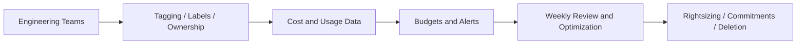

# Multi-Cloud Cost Governance Standards Handbook

Practical standards for controlling cloud spend across AWS, Azure, and Google Cloud Platform without slowing down engineering delivery.

## Audience

Engineers, technical leads, platform teams, cloud architects, and FinOps stakeholders who need a repeatable operating model for cost control.

## Objectives

- Make cloud cost visible to engineering teams.
- Prevent waste before it becomes normalized.
- Standardize tagging, budgets, ownership, and review loops.
- Align elasticity, architecture, and procurement decisions with business value.

## Governance Flow

## Core Principles

- Every cloud resource must have a clear owner.
- Shared spend must still be attributed to a team, platform, or cost center.
- Elastic infrastructure is the default unless a workload proves it needs fixed capacity.
- Cost discussions belong inside architecture review, not after invoices arrive.
- Unit economics matter more than raw spend totals.

## Tagging and Ownership Standard

Mandatory metadata for every billable resource:

- `owner`
- `application`
- `environment`
- `cost-center`
- `data-classification`
- `managed-by`
- `expiry` for temporary workloads

Resources without required metadata should be flagged automatically and blocked from production promotion where possible.

## Environment Guardrails

- Production requires budget alerts, deletion protection where appropriate, and approved SKU baselines.
- Non-production environments must use schedules, lower-cost SKUs, and expiration policies for ephemeral resources.
- Sandbox resources should be auto-cleaned unless explicitly renewed.

## Pricing Model Standards

Use the right commercial model for the right workload:

- On-demand for bursty or uncertain workloads.
- Savings Plans, Reserved Instances, or committed-use contracts for stable baselines.
- Spot or preemptible compute for interruptible batch workloads.

Do not purchase commitments before 30 to 60 days of usage evidence exists.

## Rightsizing and Elasticity

- Scale horizontally where possible instead of permanently selecting oversized instances.
- Set autoscaling thresholds from observed demand, not guesswork.
- Shut down dev and test capacity outside working hours unless there is a valid exception.
- Review idle disks, unattached IPs, stale snapshots, and forgotten clusters monthly.

## Storage and Data Transfer

Storage waste often hides in retention sprawl and forgotten replicas.

- Move infrequently accessed data to cheaper storage tiers.
- Define retention periods for logs, backups, artifacts, and snapshots.
- Measure egress and cross-region transfer before approving multi-region or multi-cloud traffic patterns.
- Avoid moving large data volumes across clouds unless there is a compelling business case.

## Showback, Chargeback, and Reporting

- Platform teams should provide monthly showback at minimum.
- Mature organizations may implement chargeback only after tagging quality is consistently high.
- Reports must show cost by team, application, environment, and architecture pattern.
- Every material variance needs an owner and an action item.

## Cloud-Specific Mappings

| Capability | AWS | Azure | GCP |
|---|---|---|---|
| Cost visibility | Cost Explorer | Cost Management | Cloud Billing Reports |
| Budgeting | AWS Budgets | Azure Budgets | Cloud Billing Budgets |
| Commitment model | Savings Plans / Reserved Instances | Reservations / Savings Plan for Compute | Committed Use Discounts |
| Optimization advisor | Compute Optimizer / Trusted Advisor | Azure Advisor | Active Assist / Recommender |
| Tagging policy enforcement | Organizations + Config + SCP patterns | Azure Policy | Organization Policy + labels and policy tooling |

## Operating Checklist

- All production resources are tagged and attributable.
- Budgets exist for every application and shared platform.
- Non-production has shutdown scheduling or expiry automation.
- Rightsizing review happens on a fixed cadence.
- Commitments are purchased only from proven baselines.
- Egress-heavy patterns are explicitly approved in architecture review.
