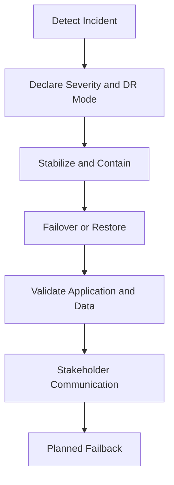

# Multi-Cloud Disaster Recovery Runbook Handbook

Operational standards for recovery planning, regional failover, backup validation, and incident coordination across AWS, Azure, and Google Cloud Platform.

## Audience

Engineers, SREs, platform teams, incident commanders, and technical leads responsible for continuity planning and recovery execution.

## Objectives

- Define a repeatable recovery operating model.
- Standardize RTO and RPO language.
- Make failover and restore steps testable instead of theoretical.
- Reduce ambiguity during high-pressure incidents.

## Recovery Flow

## RTO and RPO Standards

- Recovery Time Objective defines how long the service may be unavailable.
- Recovery Point Objective defines how much data loss is tolerable.

These values must be defined per application tier, not globally guessed.

## Recovery Patterns

- Backup and restore for low-cost, slower recovery workloads.
- Pilot light for minimal warm infrastructure.
- Warm standby for faster controlled failover.
- Active-active for the most critical workloads with the highest operational complexity.

## Runbook Requirements

Every production system must have:

- Declared RTO and RPO.
- Named recovery owner and incident commander.
- Backup location and restore procedure.
- Validation steps for application, database, and external integrations.
- Communication templates for leadership, support, and customers.
- Last test date and evidence of the most recent drill.

## Data and Replication Standards

- Replication lag must be measured and documented.
- Restore procedures must include integrity validation, not just service startup.
- Failback must be treated as a separate risk event, not an automatic step.
- Backups are not valid until restore has been tested.

## Cloud-Specific Mappings

| Capability | AWS | Azure | GCP |
|---|---|---|---|
| Global routing / failover | Route 53 / Global Accelerator | Azure Front Door / Traffic Manager | Global Cloud Load Balancing / Cloud DNS |
| VM backup | AWS Backup | Azure Backup | Backup and DR Service |
| Database replication | Aurora Global Database / DynamoDB Global Tables | Cosmos DB / Azure SQL geo-replication | Cloud Spanner / Cloud SQL replicas |
| Runbook automation | Systems Manager Automation / Step Functions | Automation / Logic Apps / Durable Functions | Workflows / Cloud Functions |
| Incident observability | CloudWatch / X-Ray | Azure Monitor / Application Insights | Cloud Monitoring / Cloud Logging |

## Drill Checklist

- Recovery roles are current.
- Failover triggers are understood.
- Backup restore has been tested recently.
- Runbooks reflect the current architecture.
- Application validation checks are automated where possible.
- Failback is rehearsed, not improvised.
